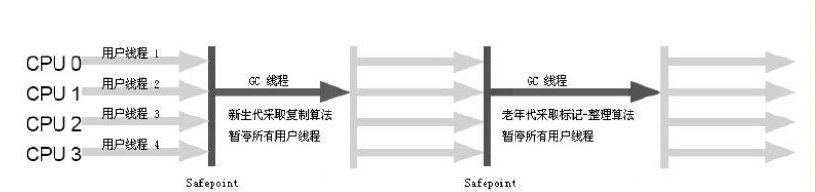
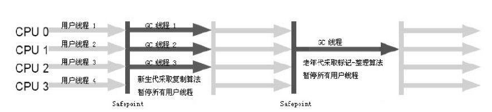
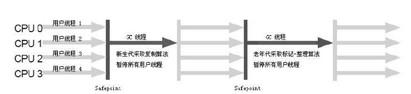
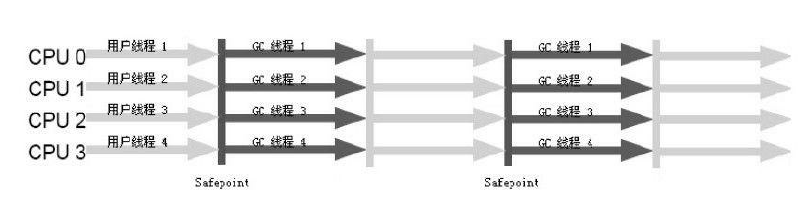
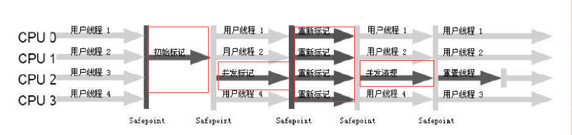
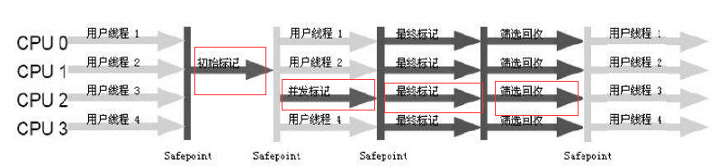

# 垃圾收集器与内存分配策略

* 引用

>java 引用分类 强引用、软引用、弱引用、虚引用

> 强引用：类似“Object obj=new Object（）”这类的引用，只要强引用还存在，垃圾收集器永远不会回收掉被引用的对象
>
用来描述一些还有用但并非必需的对象。对于软引用关联着的对象，在系统将要发生内存溢出异常之前，将会把这些对象列进回收范围之中进行第二次回收。如果这次回收还没有足够的内存，才会抛出内存溢出异常。在JDK1.2之后，提供了SoftReference类来实现软引用。
> 
>用来描述非必需对象的，但是它的强度比软引用更弱一些，被弱引用关联的对象只能生存到下一次垃圾收集发生之前。当垃圾收集器工作时，无论当前内存是否足够，都会回收掉只被弱引用关联的对象。
> 
>最弱的一种引用关系，一个对象是否有虚引用的存在，完全不会对其生存时间构成影响，也无法通过虚引用来取得一个对象实例。为一个对象设置虚引用关联的唯一目的<font color="#0099ff">在这个对象被收集器回收时收到一个系统通知</font>>

* 可达性算法

>从GC root点开始向下搜索，搜索所走过的路径称为引用链（ReferenceChain），当一个对象到GC  Roots没有任何引用链相连（用图论的话来说，就是从GCRoots到这个对象不可达）时，则证明此对象是不可用的。

>java中GC Root对象包含的内容
>   a. 虚拟机栈（栈帧中的本地变量表）中引用的对象
>   b. 方法区中类静态属性引用的对象
>   c. 方法区中常量引用的对象
>   d. 本地方法栈中JNI（即一般说的Native方法）引用的对象
>   

* 对象生存和死亡: 用可达性算法判断对象是否存活

>要经历两次标记过程，如果对象在进行可达性分析后发现没有与GC Roots相连接的引用链，那它将会被第一次标记并且进行一次筛选，<font color="#0099ff">筛选的条件是此对象是否有必要执行finalize()方法,当对象没有覆盖finalize（）方法，或者finalize（）方法已经被虚拟机调用过，虚拟机将这两种情况都视为“没有必要执行”</font>
> 
>如果这个对象被判定为有必要执行finalize（）方法，那么这个对象将会放置在一个叫做F-Queue的队列之中，并在稍后由一个由虚拟机自动建立的、低优先级的Finalizer线程去执行它。这里所谓的“执行”是指虚拟机会触发这个方法，但并不承诺会等待它运行结束，这样做的原因是，如果一个对象在finalize（）方法中执行缓慢，或者发生了死循环（更极端的情况），将很可能会导致F-Queue队列中其他对象永久处于等待，甚至导致整个内存回收系统崩溃。finalize（）方法是对象逃脱死亡命运的最后一次机会，稍后GC将对F-Queue中的对象进行第二次小规模的标记，如果对象要在finalize（）中成功拯救自己——只要重新与引用链上的任何一个对象建立关联即可，譬如把自己（this关键字）赋值给某个类变量或者对象的成员变量，那在第二次标记时它将被移除出“即将回收”的集合；如果对象这时候还没有逃脱，那基本上它就真的被回收了。
> 
>虚拟机在执行gc时，调用对象的finalize方法

```java
/**
 *此代码演示了两点:
 *1.对象可以在被GC时自我拯救。 
 *2.这种自救的机会只有一次，因为一个对象的finalize方法最多只会被系统自动调用一次
 * 
 *运行结果 
 *===============================
 *===============================
 *finalize mehtod executed！
 *yes,i am still alive
 *no,i am dead
 *  
 * @author james wang 
 */
public class FinalizeEscapeGC {
    public static FinalizeEscapeGC SAVE_HOOK = null;

    public void isAlive() {
        System.out.println("yes,i am still alive");
    }

    @Override
    protected void finalize() throws Throwable {
        super.finalize();
        System.out.println("finalize mehtod executed！");
        FinalizeEscapeGC.SAVE_HOOK = this;
    }

    public static void main(String[] args) throws Throwable {
        System.out.println("===============================");
        SAVE_HOOK = new FinalizeEscapeGC();
        // 对象第一次成功拯救自己
        SAVE_HOOK = null;
        System.out.println("===============================");
        System.gc();
        // 因为finalize方法优先级很低，所以暂停0.5秒以等待它
        Thread.sleep(500);
        if (SAVE_HOOK != null) {
            SAVE_HOOK.isAlive();
        } else {
            System.out.println("no,i am dead");
        }
        // 下面这段代码与上面的完全相同，但是这次自救却失败了
        SAVE_HOOK = null;
        System.gc();
        // 因为finalize方法优先级很低，所以暂停0.5秒以等待它
        Thread.sleep(500);
        if (SAVE_HOOK != null) {
            SAVE_HOOK.isAlive();
        } else {
            System.out.println("no,i am dead");
        }
    }
}
```

>finalize能做的所有工作，<font color="#0099ff">使用try-finally或者其他方式都可以做得更好、更及时,在java中不应该使用这种方式来保存对象的，应该忘记java中有这个方法。</font>

* 垃圾回收算法

>标记-清除算法: 算法分为“标记”和“清除”两个阶段：首先标记出所有需要回收的对象，在标记完成后统一回收所有被标记的对象.效率低 1. <font color="#0099ff">空间问题，标记清除之后会产生大量不连续的内存碎片，空间碎片太多可能会导致以后在程序运行过程中需要分配较大对象时，无法找到足够的连续内存而不得不提前触发另一次垃圾收集动作</font>
> 
>复制算法<font color="#ec0808">HotSpot新生代使用算法对象存活低的地方使用</font>: 将可用内存按容量划分为大小相等的两块，每次只使用其中的一块。当这一块的内存用完了，就将还存活着的对象复制到另外一块上面，然后再把已使用过的内存空间一次清理掉. 缺点：<font color="#0099ff">只是这种算法的代价是将内存缩小为了原
来的一半，未免太高了一点</font>
<br>
<font color="#0099ff">
&nbsp;&nbsp;&nbsp;&nbsp;&nbsp;&nbsp;&nbsp;&nbsp;新生代中的对象98%是“朝生夕死”的，所以并不需要按照1:1的比例来划分内存空间，而是将内存分为一块较大的Eden空间和两块较小的Survivor空间，每次使用Eden(伊甸园)和其中一块Survivor(幸存者) [1] 。当回收时，将Eden和Survivor中还存活着的对象一次性地复制到另外一块Survivor空间上，最后清理掉Eden和刚才用过的Survivor空间。HotSpot虚拟机默认Eden和Survivor的大小比例是8:1，也就是每次新生代中可用内存空间为整个新生代容量的90%（80%+10%），只有10%的内存会被“浪费”。当然，98%的对象可回收只是一般场景下的数据，我们没有办法保证每次回收都只有不多于10%的对象存活，当Survivor空间不够用时，需要依赖其他内存（这里指老年代）进行分配担保（Handle Promotion）。
</font>

>标记-整理算法:标记过程仍然与“标记-清除”算法一样，但后续步骤不是直接对可回收对象进行清理，而是让所有存活的对象都向一端移动，然后直接清理掉端边界以外的内存.

> <font color="#ec0808">复制算法和标记-整理算法区别：一个是复制，空间不释放，当复制完成后在一同释放空间，移动当前空间已经释放，在移动完成，再释放没有释放的空间。</font>
> 
>将虚拟机按对象的存活周期分为不同阶段，新生代、老年代、持久代，将按不同阶段开启不同的GC对象回收方法。

### HotSpot 算法实现

* Serial (串行收集器)

> 进行垃圾收集时，必须暂停其他所有的工作线程,这项工作实际上是由虚拟机在后台自动发起和自动完成的，在用户不可见的情况下把用户正常工作的线程全部停掉，这对很多应用来说都是难以接受的

<br>
运用场景
<br>
&nbsp;&nbsp;&nbsp;&nbsp;&nbsp;
简单而高效（与其他收集器的单线程比），对于限定单个CPU的环境来说，Serial收集器由于没有线程交互的开销，专心做垃圾收集自然可以获得最高的单线程收集效率。在用户的桌面应用场景中，分配给虚拟机管理的内存一般来说不会很大，收集几十兆甚至一两百兆的新生代（仅仅是新生代使用的内存，桌面应用基本上不会再大了），停顿时间完全可以控制在几十毫秒最多一百多毫秒以内，只要不是频繁发生，这点停顿是可以接受的。所以，Serial收集器对于运行在Client模式下的虚拟机来说是一个很好的选择.

* ParNew (新式收集器)

> ParNew收集器其实就是<font color="#ec0808">Serial收集器的多线程版本，除了使用多条线程进行垃圾收集之外，其余行为包括Serial收集器可用的所有控制参数.</font>


>并发：指多条垃圾收集线程并行工作，但此时用户线程仍然处于等待状态。
><br>
> 并行：指用户线程与垃圾收集线程同时执行（但不一定是并行的，可能会交替执行），用户程序在继续运行，而垃圾收集程序运行于另一个CPU上.
><br>

* Parallel Scavenge(并行清除收集器)

>ParallelScavenge收集器是一个新生代收集器，它也是使用复制算法的收集器，又是并行
的多线程收集器

不同：
<br>
目标则是达到一个可控制的吞吐量（Throughput）。所谓吞吐量就是CPU用于运行用户代码的时间与CPU总消耗时间的比值，即吞吐量=运行用户代码时间运行用户代码时间+垃圾收集时间），虚拟机总共运行了100分钟，其中垃圾收集花掉1分钟，那吞吐量就是99%
<br>
特点：
<br>
<font color="#ec0808">Parallel Scavenge收集器还有一个参数-XX：+UseAdaptiveSizePolicy值得关注。这是一个开关参数，当这个参数打开之后，就不需要手工指定新生代的大小（-Xmn）、Eden与Survivor区的比例（-XX：SurvivorRatio）、晋升老年代对象年龄（-XX：PretenureSizeThreshold）等细节参数了，虚拟机会根据当前系统的运行情况收集性能监控信息，动态调整这些参数以提供最合适的停顿时间或者最大的吞吐量，这种调节方式称为GC自适应的调节策略</font>
<br>
自适应调节策略也是Parallel Scavenge收集器与ParNew收集器的一个重要区别

* Serial Old收集器:

> <br>
 Serial收集器的老年代版本
 <br>
> <font color="#ec0808">使用“标记-整理”算法</font>
 

* Parallel Old收集器

> <br>
> Parallel Old是ParallelScavenge收集器的老年代版本，使用多线程和“标记-整理”算法
> <br>
> 

* CMS收集器 <font color="#269413">??</font>

<br>
>目前很大一部分的Java应用集中在互联网站或者B/S系统的服务端上，这类应用尤其重
视服务的响应速度，希望系统停顿时间最短，以给用户带来较好的体验
<br>
> 过程分为4个步骤，CMS收集器是基于“标记—清除”算法实现
> <br>
> &nbsp;&nbsp;&nbsp;&nbsp;&nbsp;初始标记:初始标记仅仅只是标记一下GC Roots能直接关联到的对象，速度很快
> <br>
  &nbsp;&nbsp;&nbsp;&nbsp;&nbsp;并发标记:并发标记阶段就是进行GC RootsTracing的过程从GC  Root开始对堆中对象进行可达性分析，找出存活的对象 <font color="#269413">??</font>
  <br>
  &nbsp;&nbsp;&nbsp;&nbsp;&nbsp;重新标记:为了修正并发标记期间因用户程序继续运作而导致标记产生变动的那一部分对象的标记记录
  <br>
  &nbsp;&nbsp;&nbsp;&nbsp;&nbsp;并发清除
<br>


* G1收集器

特点：
<br>
>&nbsp;&nbsp;&nbsp;&nbsp;&nbsp;并行与并发：G1能充分利用多CPU、多核环境下的硬件优势，使用多个CPU（CPU或者CPU核心）来缩短Stop-The-World停顿的时间，部分其他收集器原本需要停顿Java线程执行的GC动作，G1收集器仍然可以通过并发的方式让Java程序继续执行。
<br>
&nbsp;&nbsp;&nbsp;&nbsp;&nbsp;分代收集：与其他收集器一样，分代概念在G1中依然得以保留。虽然G1可以不需要其他收集器配合就能独立管理整个GC堆，但它能够采用不同的方式去处理新创建的对象和已经存活了一段时间、熬过多次GC的旧对象以获取更好的收集效果
<br>
&nbsp;&nbsp;&nbsp;&nbsp;&nbsp;空间整合：与CMS的“标记—清理”算法不同，G1从整体来看是基于“标记—整理”算法实现的收集器，从局部（两个Region之间）上来看是基于“复制”算法实现的，但无论如何，这两种算法都意味着G1运作期间不会产生内存空间碎片，收集后能提供规整的可用内存。这种特性有利于程序长时间运行，分配大对象时不会因为无法找到连续内存空间而提前触发下一次GC
<br>
&nbsp;&nbsp;&nbsp;&nbsp;&nbsp;可预测的停顿：这是G1相对于CMS的另一大优势，降低停顿时间是G1和CMS共同的关注点，但G1除了追求低停顿外，还能建立可预测的停顿时间模型，能让使用者明确指定在一个长度为M毫秒的时间片段内，消耗在垃圾收集上的时间不得超过N毫秒，这几乎已经是实时Java（RTSJ）的垃圾收集器的特征了
<br>


* 大对象年龄判断

> 1.虚拟机给每个对象定义了一个对象年龄（Age）计数器。如果对象在Eden出生并经过第一次Minor GC后仍然存活，并且能被Survivor容纳的话，将被移动到Survivor空间中，并且对象年龄设为1。对象在Survivor区中每“熬过”一次Minor GC，年龄就增加1岁
> <br>
> 2. 拟机并不是永远地要求对象的年龄必须达到了MaxTenuringThreshold才能晋升老年代，如果在Survivor空间中相同年龄所有对象大小的总和大于Survivor空间的一半，年龄大于或等于该年龄的对象就可以直接进入老年代，无须等到MaxTenuringThreshold中要求的年龄


