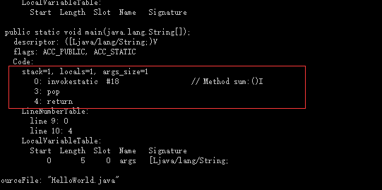
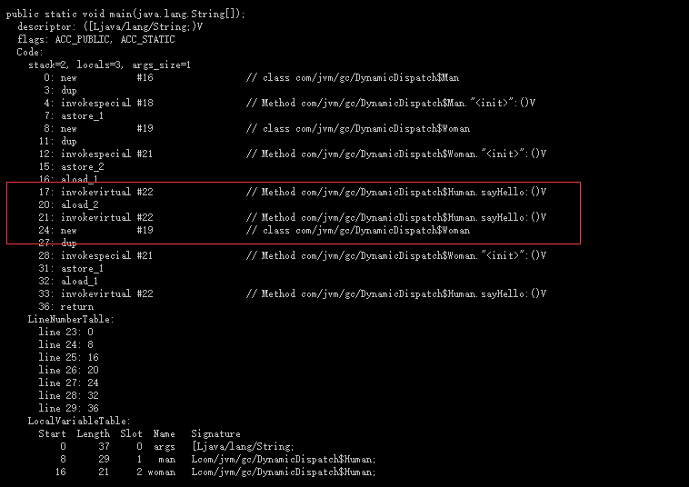

## 执行引擎(重要)

* 物理机:执行引擎是直接建立在处理器、硬件、指令集和操作系统层面
* 虚拟机:执行引擎则是由自己实现的，因此可以自行制定指令集与执行引擎的结构体系，并且能够执行那些不被硬件直接支持的指令集格式

* 运行时栈帧结构

>栈帧:支持虚拟机进行方法调用和方法执行的数据结构,它是虚拟机运行时数据区中的虚拟机栈(Virtual Machine Stack)的栈元素。栈帧存储了方法的局部变量表、操作数栈、动态连接和方法返回地址等信息.每一个方法从调用开始至执行完成的过程，都对应着一个栈帧在虚拟机栈里面从入栈到出栈的过程<br>
>一个线程中的方法调用链可能会很长，很多方法都同时处于执行状态。对于执行引擎来
说，在活动线程中，只有位于栈顶的栈帧才是有效的，称为当前栈帧<br>
>每一个栈帧都包括了局部变量表、操作数栈、动态连接、方法返回地址和一些额外的附
加信息。在编译程序代码的时候，栈帧中需要多大的局部变量表，多深的操作数栈都已经完全确定了，并且写入到方法表的Code属性之中<br>
> 每个程序在运行时，是不相互干扰的。

* 局部变量表

> 是一组变量值存储空间，用于存放方法参数和方法内部定义的局部变量<br>
> Java中占用32位以内的数据类型有boolean、byte、char、short、int、float、reference 和returnAddress(已经不使用了，之前使用他来做异常处理，现在用异常表来实现) 8种类型。前面6种不需要多加解释，读者可以按照Java语言中对应数据类型的概念去理解它们（仅是这样理解而已，Java语言与Java虚拟机中的基本数据类型是存在本质差别的),而第7种reference类型表示对一个对象实例的引用，虚拟机规范既没有说明它的长度，也没有明确指出这种引用应有怎样的结构<br>

```java
public class Test3 {
    // 存储在方法区，有初始值
    private int a;
    private int b;

    public int add() {
        // 存储在局部变量表中(占中),开始时，没有初始值
        int c = 0;
        int d = 1;
        return 0;
    }
}
```

```java
// 1. GC 结果
//[GC (System.gc())  68157K->66176K(251392K), 0.0009480 secs]
//[Full GC (System.gc())  66176K->66082K(251392K), 0.0059124 secs]
public class TestMain {
    public static void main(String[] args) {
        {
            byte[] placeholder = new byte[64 * 1024 * 1024];
        }
        System.gc();
    }
}
// 2. GC 结果
//[GC (System.gc())  68157K->66192K(251392K), 0.0008190 secs]
//[Full GC (System.gc())  66192K->546K(251392K), 0.0040344 secs]
public class TestMain {
    public static void main(String[] args) {
        {
            byte[] placeholder = new byte[64 * 1024 * 1024];
        }
        int a = 10;
        System.gc();
    }
}
// 3. GC 结果
//[GC (System.gc())  68157K->66160K(251392K), 0.0024962 secs]
//[Full GC (System.gc())  66160K->546K(251392K), 0.0043552 secs]
public class TestMain {
    public static void main(String[] args) {
        byte[] placeholder;
        {
            placeholder = new byte[64 * 1024 * 1024];
        }
        placeholder = null;
        System.gc();
    }
}
```

> 局部变量存储在slot中,局部变量表中的Slot是否还存有关于placeholder数组对象的引用。第一次修改中，代码虽然已经离开了placeholder的作用域，但在此之后，没有任何对局部变量表的读写操作，placeholder原本所占用的Slot还没有被其他变量所复用，所以作为GCRoots一部分的局部变量表仍然保持着对它的关联。这种关联没有被及时打断<br>

* 操作数栈

>当一个方法刚刚开始执行的时候，这个方法的操作数栈是空的，在方法的执行过程中，
会有各种字节码指令往操作数栈中写入和提取内容，也就是出栈/入栈操作<br>
>Java虚拟机的解释执行引擎称为“基于栈的执行引擎”，其中所指的“栈”就是操作数栈<br>
>整数加法的字节码指令iadd在运行的时候操作数栈中最接近栈顶的两个元素已经存入了两个int型的数值，当执行这个指令时，会将这两个int值出栈并相加，然后将相加的结果入栈<br>

* 动态连接

>每个栈帧都包含一个指向运行时常量池中该栈帧所属方法的引用，持有这个引用是为
了支持方法调用过程中的动态连接

* 方法调用和附加信息

> 方法调用并不等同于方法执行，方法调用阶段唯一的任务就是确定被调用方法的版本
(即调用哪一个方法),暂时还不涉及方法内部的具体运行过程

> 虚拟机规范允许具体的虚拟机实现增加一些规范里没有描述的信息到栈帧之中，例如与
调试相关的信息，这部分信息完全取决于具体的虚拟机实现.

### 方法调用
* 解析调用

>方法调用并不等同于方法执行，方法调用阶段唯一的任务就是确定被调用方法的版本<br>
>解析:方法调用中的目标方法在Class文件里面都是一个常量池中的符号引用，在类加载的解析阶段，会将其中的一部分符号引用转化为直接引用这种解析能成立的前提是：方法在程序真正运行之前就有一个可确定的调用版本，并且这个方法的调用版本在运行期是不可改变的

* 适合在类加载阶段进行解析:

```shell
静态方法、私有方法、实例构造器、父类方法4类，它们在类在编译时候就会把符号引用解析为该方法的直接引用
invokestatic：调用静态方法。
invokespecial：调用实例构造器＜init＞方法、私有方法和父类方法。
invokevirtual：调用所有的虚方法。
invokeinterface：调用接口方法，会在运行时再确定一个实现此接口的对象。
invokedynamic：先在运行时动态解析出调用点限定符所引用的方法，然后再执行该方法
```

> 

* 分派：在编译阶段不能确定常量池中的引用

> 静态分派调用: 重载

```java
/**
 * 方法静态分派演示
 * 输出结果
 * hello,guy！
 * hello,guy！
 */
public class StaticDispatch {
    static abstract class Human {
    }

    static class Man extends Human {
    }

    static class Woman extends Human {
    }

    public void sayHello(Human guy) {
        System.out.println("hello,guy！");
    }

    public void sayHello(Man guy) {
        System.out.println("hello,gentleman！");
    }

    public void sayHello(Woman guy) {
        System.out.println("hello,lady！");
    }

    public static void main(String[] args) {
        Human man = new Man();
        Human woman = new Woman();
        StaticDispatch sr = new StaticDispatch();
        sr.sayHello(man);
        sr.sayHello(woman);
    }
}
```

>main()里面的两次sayHello方法调用,在方法接收者已经确定是对象“sr”的前提下,使用哪个重载版本，就完全取决于传入参数的数量和数据类型<br>
> 所有依赖静态类型来定位方法执行版本的分派动作称为静态分派<br>

```java
// 匹配方式：char-＞int-＞long-＞float-＞double的顺序转型进行匹配
public class Overload {
    public static void sayHello(Object arg) {
        System.out.println("hello Object");
    }

    public static void sayHello(int arg) {
        System.out.println("hello int");
    }

    public static void sayHello(long arg) {
        System.out.println("hello long");
    }

    public static void sayHello(Character arg) {
        System.out.println("hello Character");
    }

    public static void sayHello(char arg) {
        System.out.println("hello char");
    }

    public static void sayHello(char... arg) {
        System.out.println("hello char……");
    }

    public static void sayHello(Serializable arg) {
        System.out.println("hello Serializable");
    }

    public static void main(String[] args) {
        sayHello('a');
    }
}
```

> 动态分派调用: 它和多态性的另外一个重要体现--重写（Override）有着很密切的关联

```java
/**
 *invokevirtual
 * 1.找到操作数栈顶的第一个元素所指向的对象的实际类型，记作C。
 * 
 * 2.如果在类型C中找到与常量中的描述符和简单名称都相符的方法，则进行访问权限校 验，如果通过则返回这个方法的直接引用，查找过程结束；如果不通过，则返回
 * java.lang.IllegalAccessError异常。
 * 
 * 3.否则，按照继承关系从下往上依次对C的各个父类进行第2步的搜索和验证过程。
 * 
 * 4.如果始终没有找到合适的方法，则抛出java.lang.AbstractMethodError异常。
 * 
 * 
 * @author wyx
 *
 */
public class DynamicDispatch {
    static abstract class Human {
        protected abstract void sayHello();
    }

    static class Man extends Human {
        @Override
        protected void sayHello() {
            System.out.println("man say hello");
        }
    }

    static class Woman extends Human {
        @Override
        protected void sayHello() {
            System.out.println("woman say hello");
        }
    }

    public static void main(String[] args) {
        Human man = new Man();
        Human woman = new Woman();
        man.sayHello();
        woman.sayHello();
        man = new Woman();
        man.sayHello();
    }
}
```



* 动态类型语言支持

静态类型语言
> 静态类型的语言在非运行阶段，变量的类型是可以确定的，变量是存有类型的.

动态类型语言
> 什么是动态类型语言？动态类型语言的关键特征是它的类型检查的主体过程是在运行
期而不是编译期，满足这个特征的语言有很多，常用的包括：APL、Clojure、Erlang、
Groovy、JavaScript、Jython、Lisp、Lua、PHP、Prolog、Python、Ruby、Smalltalk和Tcl等

>运行时异常就是只要代码不运行到这一行就不会有问题。与运行时异常相对应的是连接时异常,例如很常见的NoClassDefFoundError便属于连接时异常，即使会导致连接时异常的代码放在一条无法执行到的分支路径上，类加载时（Java的连接过程不在编译阶段，而在类加载阶段）也照样会抛出异常