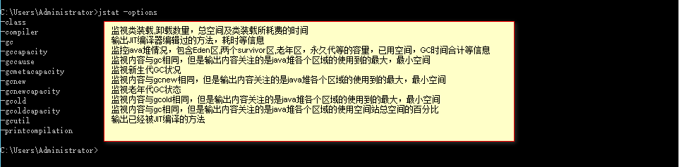
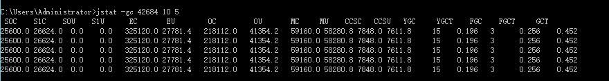
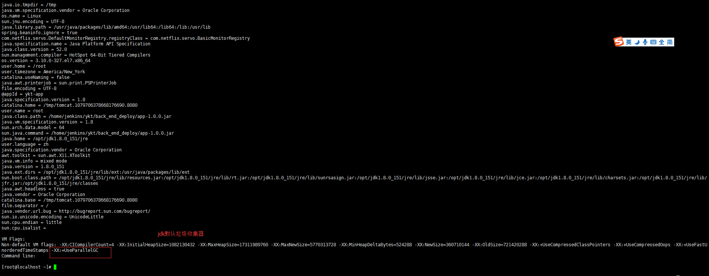
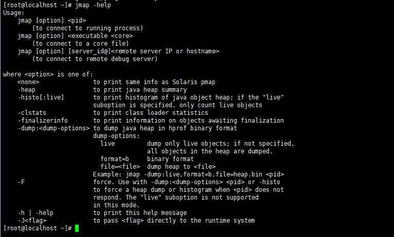
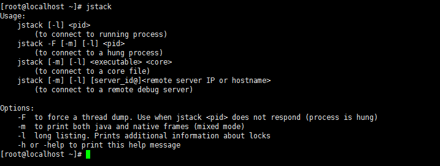
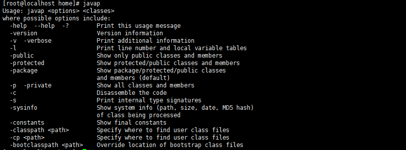

# 虚拟机性能监控与故障处理工具

* jps：虚拟机进程状况工具

```sh
# 省略主类的名称
jps -q

# 输出虚拟机进程在启动时传递给主类main()函数的参数
jps -m

# 输出主类的全名，如果进程执行的是jar包，输出jar路径
jps -l

# 输出虚拟机进程启动时的jvm参数
jps -v
```

* jstat：虚拟机统计信息监视工具

> 它可以显示本地或者远程虚拟机进程中的类装载、内存、垃圾收集、JIT编译等运行数据
> 
> 
> <a href="http://blog.csdn.net/zhushuai1221/article/details/52122880">Java 8: 从永久代（PermGen）到元空间(Metaspace)</a>
> 
> GC 先关术语<br>
> <br>
  S0C：年轻代中第一个survivor（幸存区）的容量 (字节)<br>
  S1C：年轻代中第二个survivor（幸存区）的容量 (字节)<br>
  S0U：年轻代中第一个survivor（幸存区）目前已使用空间 (字节)<br>
  S1U：年轻代中第二个survivor（幸存区）目前已使用空间 (字节)<br>
  EC：年轻代中Eden（伊甸园）的容量 (字节)<br>
  EU：年轻代中Eden（伊甸园）目前已使用空间 (字节)<br>
  OC：Old代的容量 (字节)<br>
  OU：Old代目前已使用空间 (字节)<br> 
  MC：元空间的容量 (字节)<br>
  MU：元空间目前已使用空间 (字节)<br>
  CCSC:压缩类空间大小<br>
  CCSU:压缩类空间使用大小<br>
  YGC：从应用程序启动到采样时年轻代中gc次数<br>
  YGCT：从应用程序启动到采样时年轻代中gc所用时间(s)<br>
  FGC：从应用程序启动到采样时old代(全gc)gc次数<br>
  FGCT：从应用程序启动到采样时old代(全gc)gc所用时间(s)<br>
  GCT：从应用程序启动到采样时gc用的总时间(s)<br>
  <br>
  这台服务器的新生代Eden区（E，表示Eden）使用了8.54%的空间，两个Survivor区（S0、S1，表示Survivor0、Survivor1）里面都是空的，老年代（O，表示Old）和元空间（M，表示Metaspace）则分别使用了18.96%和98.54%的空间。程序运行以来共发生Minor GC（YGC，表示YoungGC）15次，总耗时0.196秒，发生FullGC（FGC，表示FullGC）3次，FullGC总耗时（FGCT,表示FullGCTime）为0.256秒，所有GC总耗时（GCT，表示GCTime）为0.452秒。

* jinfo: 实时地查看和调整虚拟机各项参数

```sh
jinfo [pid]
```

> <br>
> jdk8 默认是串行收集器

* jmap：Java内存映像工具:用于生成堆转储快照(一般称为heapdump或dump文件)

>jmap的作用并不仅仅是为了获取dump文件，它还可以查询finalize执行队列、Java堆和元空间的详细信息，如空间使用率、当前用的是哪种收集器等
<br>

```sh
# linux 环境下

# --dump堆到文件,live指明是活着的对象,file指定文件名
jmap -dump:live,file=a.map 2137

# -finalizerinfo  打印等待回收对象的信息
jmap -finalizerinfo 2137

# -heap  打印堆总结
jmap -heap 2137

# -histo[:live]  打印堆的对象统计，包括对象数、内存大小等等
jmap -histo 2137
```

* <font color="#e80f0f">使用eclipse Memory Analyzer进行内存堆栈分析</font>

* jstack：Java堆栈跟踪工具

> <font color="#0e4bd8">线程快照就是当前虚拟机内每一条线程正在执行的方法堆栈的集合，生成线程快照的主要目的是定位线程出现长时间停顿的原因，如线程间死锁、死循环、请求外部资源导致的长时间等待等都是导致线程长时间停顿的常见原因。线程出现停顿的时候通过jstack来查看各个线程的调用堆栈，就可以知道没有响应的线程到底在后台做些什么事情，或者等待着什么资源.</font>
> <br>

```sh
# 添加是为了让打印信息发送到文件中，并将其处理

# -F当’jstack [-l] pid’没有相应的时候强制打印栈信息
jstack -F  2137  >> all.log

# -l长列表. 打印关于锁的附加信息,例如属于java.util.concurrent的ownable synchronizers列表.
jstack -l 2137  >> all.log

# -m打印java和native c/c++框架的所有栈信息
jstack -m 2137 >> all.log

# -h | -help打印帮助信息
jstack -h
```

* extcheck是JDK自带的jar文件检测工具

> 主要用于检测指定的jar文件与Java SDK安装的任何扩展之间是否存在版本冲突。在安装一个扩展之前，你可以使用此工具来检测是否已经安装该扩展的相同版本或最新版本
> 如果没有检测出冲突问题，则返回代码为0。

```sh
#可选参数-verbose表示显示详细的检测信息；
#可选参数-J<runtime flag>可以有多个，用于指定可选的运行时参数，例如：-J-Xms48m。
#参数target.jar表示指定的jar文件。
extcheck [-verbose] [-J<runtime flag>] target.jar
```

* javap:是JDK自带的反汇编工具，用于将Java字节码文件反汇编为Java源代码

> <br>

```sh
用法: javap <options> <classes>
可能的选项包括:
  -help  --help  -?        打印用法信息
  -version                 版本信息
  -v  -verbose             打印附加信息
  -l                       打印行号和本地变量表
  -public                  仅显示public类和成员
  -protected               显示protected/public类和成员
  -package                 显示package/protected/public类和成员(默认值)
  -p  -private             显示所有的类和成员
  -c                       反汇编代码
  -s                       打印内部类型签名
  -sysinfo                 显示将被处理的类的系统信息(路径，大小，日期，MD5 哈希值)
  -constants               显示static final常量
  -classpath <path>        指定查找用户类文件的位置
  -bootclasspath <path>    覆盖由引导类加载器所加载的类文件的位置
```

