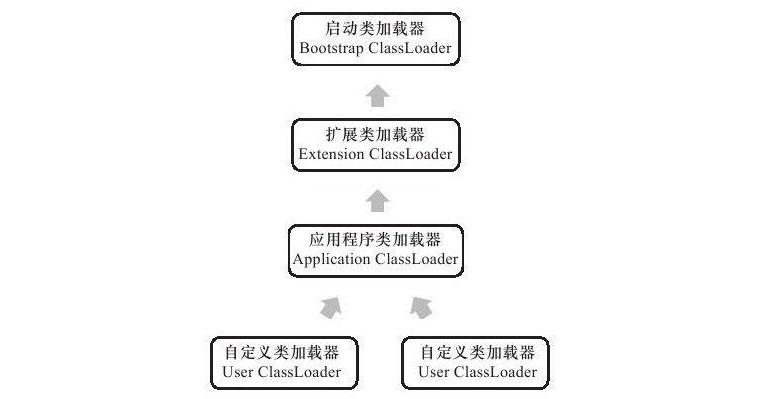

## 虚拟机类加载机制

* 虚拟机把描述类的数据从Class文件加载到内存，并对数据进行校验、转换解析和初始
化，最终形成可以被虚拟机直接使用的Java类型，这就是虚拟机的类加载机制
* 本地字节码转化为字节码(编译)
* Class文件中描述的各种信息，最终都需要加载到虚拟机中之后才能运行和使用
* 虚拟机如何加载这些Class文件？
* Class文件中的信息进入到虚拟机后会发生什么变化?
* 虚拟机把描述类的数据从Class文件加载到内存，并对数据进行校验、转换解析和初始
化，最终形成可以被虚拟机直接使用的Java类型，这就是虚拟机的类加载机制
* 类型的加载、连接和初始化过程都是在程序运行期间完成的,这种策略虽然会令类加载时稍微增加一些性能开销，但是会为Java应用程序提供高度的灵活性,Java里天生可以动态扩展的语言特性就是依赖运行期动态加载和动态连接这个特点实现的
* java使用的是一种懒加载的方式，当使用时，才加载

>如果编写一个面向接口的应用程序，可以等到运行时再指定其实际的实现类；用户可以通过Java预定义的和自定义类加载器，让一个本地的应用程序可以在运行时从网络或其他地方加载一个二进制流作为程序代码的一部分

### 类加载的时机

* 类从被加载到虚拟机内存中开始，到卸载出内存为止，它的整个生命周期包括：加载、(验证、准备、解析---连接)、初始化、使用和卸载7个阶段
* 加载和连接是并行的，但是有一段时间是同步的，加载后才连接(验证，准备，解析)

>1.遇到new、getstatic、putstatic或invokestatic这4条字节码指令时，如果类没有进行过初始化，则需要先触发其初始化，成这4条指令的最常见的Java代码场景是：使用new关键字实例化对象的时候、读取或设置一个类的静态字段（被final修饰、已在编译期把结果放入常量池的静态字段除外）的时候，以及调用一个类的静态方法的时候<br>
>2.使用java.lang.reflect包的方法对类进行反射调用的时候,如果类没有进行过初始化，
则需要先触发其初始化<br>
>3.当初始化一个类的时候，如果发现其父类还没有进行过初始化，则需要先触发其父
类的初始化
>4.当虚拟机启动时，用户需要指定一个要执行的主类（包含main（）方法的那个
类),虚拟机会先初始化这个主类

* 不被初始化的是
* 通过子类引用父类的静态字段
* 通过数组定义来引用类
* 调用类的常量

```java
/**
*只会输出“SuperClass init！”，而不会输出“SubClass init！”。对于静态字段，只有直接定义这个字段的类才会被初始化，因此通过其子类来引用父类中定义的静态字段，只会触发父类的初始化而不会触发子类的初始化
*/

/**
 * 被动使用类字段演示一： 通过子类引用父类的静态字段，不会导致子类初始化
 **/
public class SuperClass {
    static {
        System.out.println("SuperClass init！");
    }
    public static int value = 123;
}

public class SubClass extends SuperClass {
    static {
        System.out.println("SubClass init！");
    }
}
/**
 * 非主动使用类字段演示
 **/
public class NotInitialization {
    public static void main(String[] args) {
        System.out.println(SubClass.value);
    }
}
```

### 类加载的过程
* 加载,在加载阶段，虚拟机需要完成以下3件事情

>1.通过一个类的全限定名来获取定义此类的二进制字节流(类似的class文件)<br>
>2.将这个字节流所代表的静态存储结构(是虚拟机厂商定义的：类似于spring中的xml文件中的bean，当加载时，使用名字加载就OK)转化为方法区的运行时数据结构<br>
>3.在内存中生成一个代表这个类的java.lang.Class对象，作为方法区这个类的各种数据
的访问入口<br>

>4.从ZIP包中读取，这很常见，最终成为日后JAR、EAR、WAR格式的基础
>5. 从网络中获取，这种场景最典型的应用就是Applet
>6.运行时计算生成，这种场景使用得最多的就是动态代理技术，在java.lang.reflect.Proxy中，就是用了ProxyGenerator.generateProxyClass来为特定接口生成形式为“*$Proxy”的代理类的二进制字节流
>7.<font color="#f50f0f">把程序安装到数据库中来完成程序代码在集群间的分发</fon>
>8.开发人员可以通过定义自己的类加载器去控制字节流的获取方式
>9.数组类本生不通过类加载器创建，他是有java虚拟机直接创建的，但是数组的原数类型最终是由类加载器去创建的。</font>
>10.加载阶段与连接阶段的部分内容（如一部分字节码文件格式验证动作）是交叉进行的

* 验证:创建连接的第一步

>1.验证是连接阶段的第一步,这一阶段的目的是为了确保Class文件的字节流中包含的信息
符合当前虚拟机的要求,并且不会危害虚拟机自身的安全<br>
>2. 虚拟机如果不检查输入的字节流，对其完全信任的话，很可能会因为载入了有害的字节流而导致系统崩溃，所以验证是虚拟机对自身保护的一项重要工作<br>

* 验证的内容(虚拟机可以通过配置来跳过验证)

> 1.文件格式验证,第一阶段要验证字节流是否符合Class文件格式的规范，并且能被当前版本的虚拟机处理<br>
> 2.元数据验证:以保证其描述的信息符合Java语言规范的要求<br>
> 3.字节码验证:目的的是通过数据流和控制流分析,确定程序语义是合法的、符合逻辑的<br>
> 4.符号引用验证:解析阶段，符号引用验证的目的是确保解析动作能正常执行如果无法通过符号引用验证，<font>那么将会抛出一个java.lang.IncompatibleClassChangeError异常的子类，如java.lang.IllegalAccessError、java.lang.NoSuchFieldError、java.lang.NoSuchMethodError等</font><br>

* 准备

>1.准备阶段是<font color="#f50f0f">正式为类变量分配内存并设置类变量初始值的阶段，这些变量所使用的内存都将在方法区中进行分配,进行内存分配的仅包括类变量（被static修饰的变量），而不包括实例变量，实例变量将会在对象实例化时随着对象一起分配在Java堆中.</font>

```java
//变量value在准备阶段过后的初始值为0而不是123，因为这时候尚未开始执行任何Java方法，而把value赋值为123的putstatic指令是程序被编译后存放于类构造器＜clinit＞（）方法之中，所以把value赋值为123的动作将在初始化阶段才会执行
public static int value=123；
// 编译时Javac将会为value生成ConstantValue属性，在准备阶段虚拟机就会根据ConstantValue的设置将value赋值为123
public static final value=123;
```

* 解析（重要的）

>1. 解析阶段是虚拟机将常量池内的符号引用替换为直接引用的过程<br>
>2. 符号引用:<font color="#253fc7">符号引用以一组符号来描述所引用的目标</font>，符号可以是任何形式的字面量<font color="#f50f0f">字面量是指由字母，数字等构成的字符串或者数值</font>，只要使用时能无歧义地定位到目标即可。符号引用与虚拟机实现的内存布局无关，引用的目标并不一定已经加载到内存中。各种虚拟机实现的内存布局可以各不相同，但是它们能接受的符号引用必须都是一致的，因为符号引用的字面量形式明确定义在Java虚拟机规范的Class文件格式中<br>
>3. 直接引用: <font color="#253fc7">直接引用可以是直接指向目标的指针、相对偏移量或是一个能间接定位到目标的句柄</font>。直接引用是和虚拟机实现的内存布局相关的，同一个符号引用在不同虚拟机实例上翻译出来的直接引用一般不会相同。如果有了直接引用，那引用的目标必定已经在内存中存在。<br>
>4. 类或接口的解析、字段解析、类方法解析、接口方法解析

* 初始化(类加载的最后阶段)

>1.<font color="#253fc7">开始执行类中定义的Java程序代码</font>,初始化阶段是执行类构造器<clinit>()方法的过程clinit()方法是由编译器自动收集类中的所有类变量的赋值动作和静态语句块（static{}块）中的语句合并产生的，编译器收集的顺序是由语句在源文件中出现的顺序所决定的，静态语句块中只能访问到定义在静态语句块之前的变量，定义在它之后的变量，在前面的静态语句块可以赋值，但是不能访问.<br>

```java
public class Test{
    
    static {
        i = 0;
        System.out.println(i);
    }
    static int i = 1;
}
```

2.i＜clinit＞（）方法与类的构造函数（或者说实例构造器＜init＞（）方法）不同，它不需要显式地调用父类构造器，虚拟机会保证在子类的＜clinit＞（）方法执行之前，父类的＜clinit＞（）方法已经执行完毕。因此在虚拟机中第一个被执行的＜clinit＞（）方法的类肯定是java.lang.Object<br>

```java
// 2.虚拟机会保证在子类的＜clinit＞（）方法执行之前，父类的＜clinit＞（）方法已经执行完毕
static class Parent{
    public static int A=1;
        static{
            A=2;
        }
}
static class Sub extends Parent{
    public static int B=A;
}
public static void main (String[] args){
    System.out.println(Sub.B);
}
```

3.虚拟机会保证一个类的＜clinit＞（）方法在多线程环境中被正确地加锁、同步，如果多个线程同时去初始化一个类，那么只会有一个线程去执行这个类的＜clinit＞（）方法其他线程都需要阻塞等待，直到活动线程执行＜clinit＞（）方法完毕。如果在一个类的＜clinit＞()方法中有耗时很长的操作，就可能造成多个进程阻塞

```java

// 运行结果
//Thread[Thread-0,5,main]start
//Thread[Thread-1,5,main]start
//Thread[Thread-0,5,main]init DeadLoopClass

public class Test2 {
    static class DeadLoopClass {
        static {
            /* 如果不加上这个if语句，编译器将提示"Initializer does not complete normally"并拒绝编译 */
            if (true) {
                System.out.println(Thread.currentThread() + "init DeadLoopClass");
                while (true) {
                }
            }
        }
    }

    public static void main(String[] args) {
        Runnable script = new Runnable() {
            public void run() {
                System.out.println(Thread.currentThread() + "start");
                DeadLoopClass dlc = new DeadLoopClass();
                System.out.println(Thread.currentThread() + "run over");
            }
        };
        Thread thread1 = new Thread(script);
        Thread thread2 = new Thread(script);
        thread1.start();
        thread2.start();
    }
}

```

* 类加载器（重要，加密二进制字节流，加载时进行解析）

>1."通过一个类的全限定名来获取描述此类的二进制字节流"这个动作放到Java虚拟机外部去实现，以便让应用程序自己决定如何去获取所需要的类
>2.类与类加载器:对于任意一个类，都需要由加载它的类加载器和这个类本身一同确立其在Java虚拟机中的唯一性，每一个类加载器，都拥有一个独立的类名称空间
>3.判读两个类是否相同是那么必须这两个类应该要被同一个类加载器加载，如果被不同的加载器加载那么形成的class对象不是同一个对象

```java

/**
    *响应结果
    *class com.jvm.ClassLoaderTest
    *false
    *自定义类加载器的方法：继承classLoader类，重写loadClass方法
**/
package com.jvm;

import java.io.IOException;
import java.io.InputStream;

/**
 * 类加载器与instanceof关键字演示
 *
 * @author wyx
 */
public class ClassLoaderTest {
    public static void main(String[] args) throws Exception {
        ClassLoader myLoader = new ClassLoader() {
            @Override
            public Class<?> loadClass(String name) throws ClassNotFoundException {
                try {
                    String fileName = name.substring(name.lastIndexOf(".") + 1) + ".class";
                    InputStream is = getClass().getResourceAsStream(fileName);
                    if (is == null) {
                        return super.loadClass(name);
                    }
                    byte[] b = new byte[is.available()];
                    is.read(b);
                    return defineClass(name, b, 0, b.length);
                } catch (IOException e) {
                    throw new ClassNotFoundException(name);
                }
            }
        };
        // 用自己的类加载器加载
        Object obj = myLoader.loadClass("com.jvm.ClassLoaderTest").newInstance();
        System.out.println(obj.getClass());
        // 一个是由系统应用程序类加载器加载的
        System.out.println(obj instanceof com.jvm.ClassLoaderTest);
    }
}
```

* 启动类加载器，这个类加载器使用C++语言实现,是虚拟机自身的一部分

这个类将器负责将存放在＜JAVA_HOME＞\lib目录中的，或者被-Xbootclasspath参数所指定的路径中的，并且是虚拟机识别的（仅按照文件名识别，如rt.jar，名字不符合的类库即使放在lib目录中也不会被加载）类库加载到虚拟机内存中。启动类加载器无法被Java程序直接引用，用户在编写自定义类加载器时，如果需要把加载请求委派给引导类加载器，那直接使用null代替即可.

* 扩展类加载器

这个加载器由sun.misc.Launcher$ExtClassLoader实现，它负责加载＜JAVA_HOME＞\lib\ext目录中的，或者被java.ext.dirs系统变量所指定的路径中的所有类库，开发者可以直接使用扩展类加载器

* 应用程序加载器(用的比较多的)

这个类加载器由sun.misc.Launcher $App-
ClassLoader实现。由于这个类加载器是ClassLoader中的getSystemClassLoader（）方法的返回值，所以一般也称它为系统类加载器。它负责加载用户类路径（ClassPath）上所指定的类库，开发者可以直接使用这个类加载器，如果应用程序中没有自定义过自己的类加载器,一般情况下这个就是程序中默认的类加载器

* 自定义类加载器

用户自定义实现，这些类加载器都由Java语言实现，独立于虚拟机外部,并且全都继承自抽象类java.lang.ClassLoader.<br>

* 类加载器是怎样协作工作的?

使用双亲委派模型来进行加载：如果一个类加载器收到了类加载的请求，它首先不会自己
去尝试加载这个类，而是把这个请求委派给父类加载器去完成，每一个层次的类加载器都是如此，因此所有的加载请求最终都应该传送到顶层的启动类加载器中，只有当父加载器反馈自己无法完成这个加载请求（它的搜索范围中没有找到所需的类）时，子加载器才会尝试自己去加载


> 

* 优势: 避免相同的类在虚拟机中出现多个不同的类

Java类随着它的类加载器一起具备了一种带有优先级的层次关系，例如类java.lang.Object，它存放在rt.jar之中，无论哪一个类加载器要加载这个类，最终都是委派给处于模型最顶端的启动类加载器进行加载，因此Object类在程序的各种类加载器环境中都是同一个类。相反，如果没有使用双亲委派模型，由各个类加载器自行去加载的话，如果用户自己编写了一个称为java.lang.Object的类,并放在程序的ClassPath中,那系统中将会出现多个不同的Object类,Java类型体系中最基础的行为也就无法保证,应用程序也将会变得一片混乱

```java

//  java 源代码中的ClassLoader 中
    protected Class<?> loadClass(String name, boolean resolve)
        throws ClassNotFoundException
    {
        synchronized (getClassLoadingLock(name)) {
            // First, check if the class has already been loaded
            Class<?> c = findLoadedClass(name);
            if (c == null) {
                long t0 = System.nanoTime();
                try {
                    if (parent != null) {
                        c = parent.loadClass(name, false);
                    } else {
                        c = findBootstrapClassOrNull(name);
                    }
                } catch (ClassNotFoundException e) {
                    // ClassNotFoundException thrown if class not found
                    // from the non-null parent class loader
                }

                if (c == null) {
                    // If still not found, then invoke findClass in order
                    // to find the class.
                    long t1 = System.nanoTime();
                    c = findClass(name);

                    // this is the defining class loader; record the stats
                    PerfCounter.getParentDelegationTime().addTime(t1 - t0);
                    PerfCounter.getFindClassTime().addElapsedTimeFrom(t1);
                    PerfCounter.getFindClasses().increment();
                }
            }
            if (resolve) {
                resolveClass(c);
            }
            return c;
        }
    }
```

