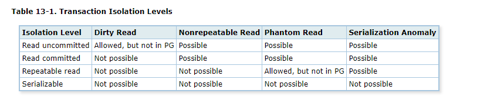
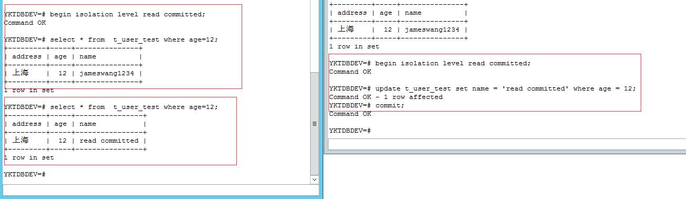
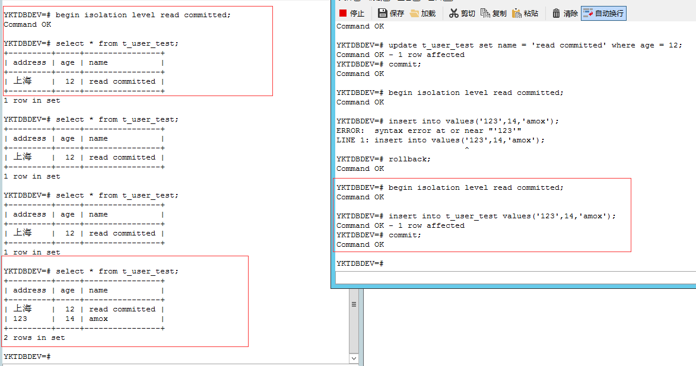
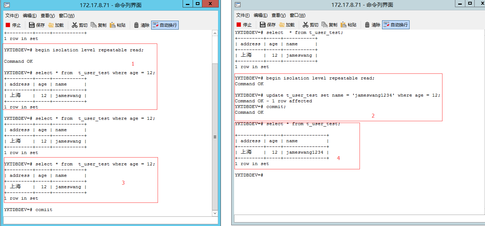
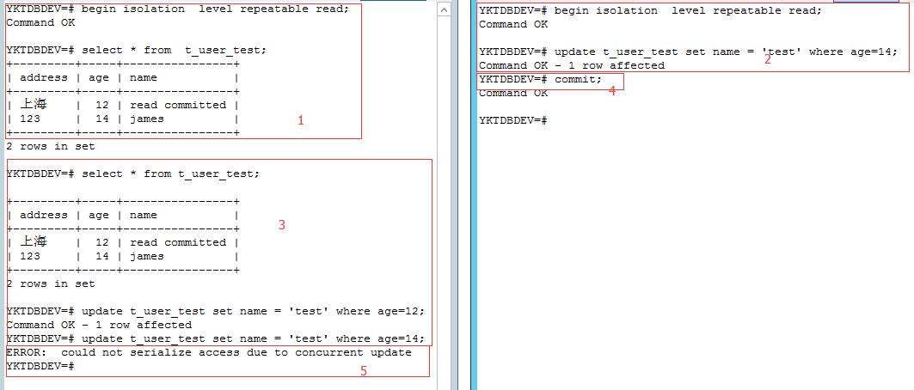
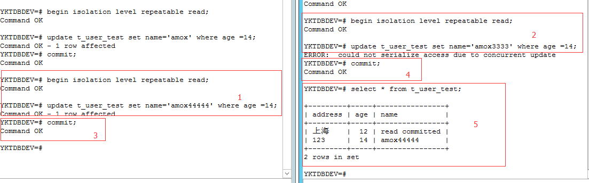

## postgres-9.6 务的隔离级别

#### 相关概念

* pg 事物列表
>

* 脏读
> 在一个事务中可以读到其他未提交的事务产生或变更的数据

* 不可重复读
> 在一个事务中,再次读取前面SQL读过的数据时,可能出现读取到的数据和前面读取到的不一致的现象. (例如其他事务在此期间已提交的数据)
> 不可重复读



* 幻影
> 在一个事务中, 再次执行同样的SQL, 得到的结果可能不一致.
> 幻读



* 使用repeatable read可避免不可重复读和幻象读.(读事物没有提交)
>

#### 数据库开启事物相关语句

* sql server 事物相关相关语句

```sql
SET TRANSACTION ISOLATION LEVEL REPEATABLE READ;
BEGIN TRANSACTION;
SELECT * FROM [DB268].[dbo].[T_AVSOFT] WHERE xxx=12;
COMMIT TRANSACTION;
```

* pg 事物相关相关语句

```sql
BEIGIN ISOLATION LEVEL REPEATABLE READ;
SELECT * FROM T_USER_TEST ;
COMMIT;
```

* mysql 事物相关相关语句
```sql
SET TRANSACTION ISOLATION LEVEL REPEATABLE READ;
START TRANSACTION;
SELECT * FROM t_user WHERE xxx=12;
COMMIT TRANSACTION;
```

#### pg 案例

* 当repeatableread的事务去更新或删除在事务过程中被其他事务已经变更过的数据时,将报错等待回滚
> <br/>
> 1. T1 : 开启repeatable read 隔离级别,并查询结果<br/>
> 2. T2 : 开启repeatable read 隔离级别,修改记录<br/>
> 3. T1 ：修改不相关记录,正常修改,修改T2中修改的记录,等待<br/>
> 4. T2 : 提交事物<br/>
> 5. T1 : 在T2提交事物的瞬间，T1报错<br/>
> <br/>
> <br/>
> <br/>
> <br/>
> <br/>
> 两个事物都修改数据，生效数据是后面提交的，不论谁的事物先开启。


pg和mysql没有串行执行(在update，delete做串行)
sqlserver 使用的是串行（进行串行，select也做了串行）