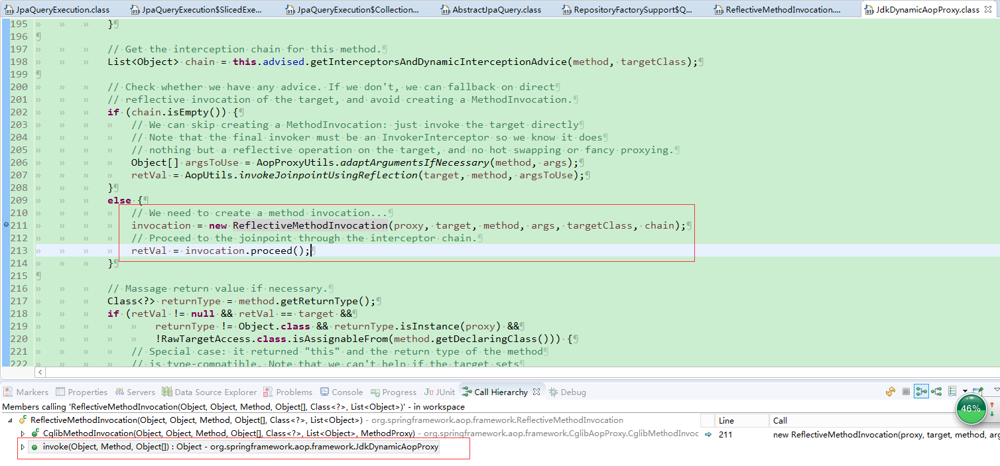
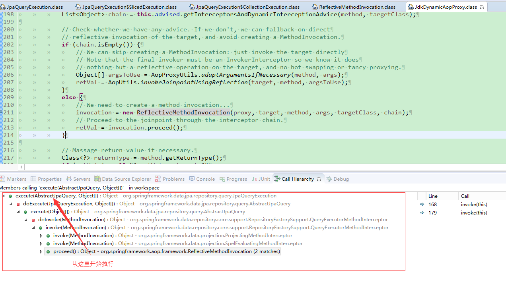

## spring-data-jpa 源码解析

#### 资源连接
* [spring-data-jpa官网链接](https://docs.spring.io/spring-data/jpa/docs/1.11.6.RELEASE/reference/html/)
* 分析源码，搭建demo，将日志级别调制debug从日志中可以看到相应的加载顺序，找到相应入口
* [参考博客](https://blog.csdn.net/gaolu/article/details/53415420)

#### JpaQueryExecution
* 相关概念介绍
> jpa-image QueryExecute中有如下一些实现，其中实现类都是内部类jpaQueryExecution的作用就是，对类变量JpaQueryMethodmethod类实例进行判断，通过AbstractJpaQuery类的protected JpaQueryExecution getExecution()方法，选择一个JpaQueryExecution的子类进行实例化
![] (./jpa-image/jpa-query-execute.png)

> 在执行某个Repository中的摸个接口时，最终调用的就是这个方法来执行我们的操作

```java
    public Object execute(AbstractJpaQuery query, Object[] values) {
        Object result;
        try {
            result = doExecute(query, values);
        } catch (NoResultException e) {
            return null;
        }
        if (result == null) {
            return null;
        }
        // 通过该方法获取不同的JpaQueryMethod对象=====================
        JpaQueryMethod queryMethod = query.getQueryMethod();
        Class<?> requiredType = queryMethod.getReturnType();

        if (void.class.equals(requiredType) || requiredType.isAssignableFrom(result.getClass())) {
            return result;
        }

        return CONVERSION_SERVICE.canConvert(result.getClass(), requiredType)
                ? CONVERSION_SERVICE.convert(result, requiredType) : result;
    }
```

执行图解：
<br/>



